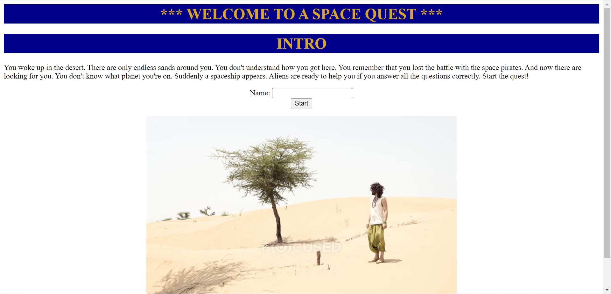
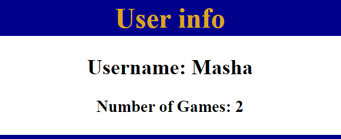
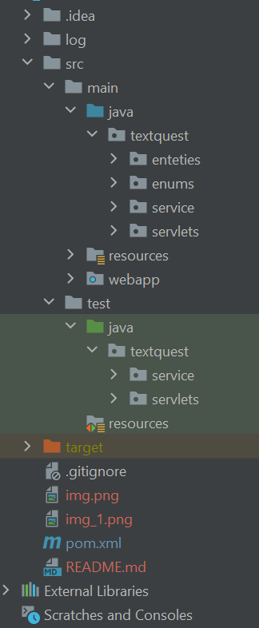
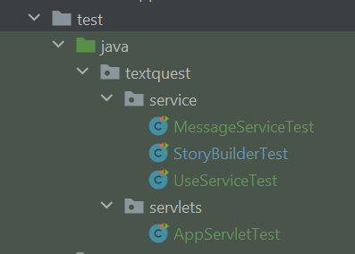
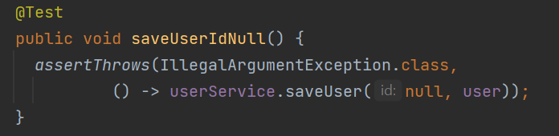

# Text Quest (Java Rush Module Project)

## Introduction

It is a training project, final project of Module 3 of JavaRush University
course. This is the simple web application of text quest. This application 
created to memorize and practice new technologies (Java EE module). On the
start page you should enter the name to start it. The application counts 
the number of games of each User and shows the statistic on the top of the page.

## Technologies

- Java 18.0.2.1

- Apache Maven 3.8.6

- Servlet API 4.0.1

- Lombok 1.18.24

- Log4j 1.2.17

- Mockito 4.8.0

- Junit api 5.9.1

- Tomcat 9.0.68

- Basic JSP concepts

# Structure
The project has maven structure. 
There are main entities of the guest in package entities: Answer, Message, User.
There are two enums: MessageNumbers, MessageParameters. It is used for creating
the whole story of the quest in StoryBuilder class.
There are four services:
MessageService - it contains methods to get the text of the message, message ID,
ID of the next message depends on the User answer.
PropertiesLoader - this class loads properties from quest.properties file, that
includes all messages and there parameters, such as ID, answer, nextID.
StoryBuilder - the class that creates the Set of Messages from quest.properties file.
UserServer - this class keep the data of Users who play in current session,
check if the User exists, if not it creates the User and save it to the Map.
The package servlets includes only AppServlet, that has doPost and doGet methods.

The package webapp includes index.jsp, quest.jst and statistic.jsp,
the last is used as parts in quest.jsp. It also includes images for each step
of the quest.
Information about the structure of test package you will find in the next paragraph. 

# Tests
The project include Unit tests for classes of service and servlets packages.

There are as negative test and positive ones. Mockito library is used in this project.
Here is the example of test class  UserService, if one of the arguments is 
null:

# SetUp
Please check if appropriate versions of Maven, Java and Tomcat are installed.
Clone the project from GitHub.
Built the project with the command: mvn clean install.
Check that the build was made successfully, all tests ran successfully.
Deploy with the Tomcat server. 

# TODO
Create Exception handler.
Create Docker file. 
Deploy it to https://dashboard.render.com. 
